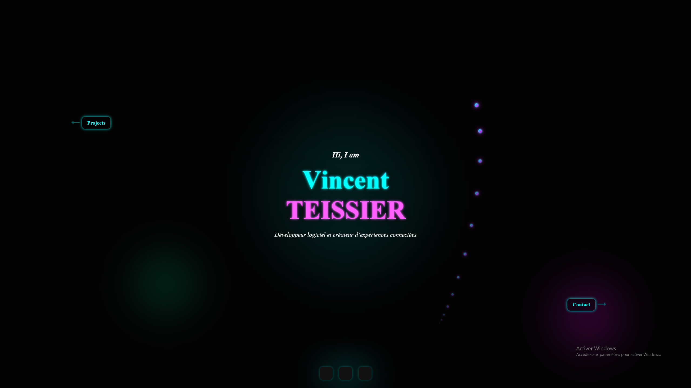

# 🌐 Portfolio — Vincent TEISSIER

Bienvenue sur le dépôt de mon **portfolio personnel**, une vitrine interactive et immersive de mes projets, compétences et expériences dans le domaine du développement logiciel.

---

## 🚀 Aperçu

Ce site présente :

- Une **interface animée** et réactive, avec un thème **cyberpunk/néon**.
- Des **effets visuels personnalisés** : glitch, halos lumineux, curseur animé.
- Un **système de scroll snap intelligent**, pour une navigation fluide par section.
- Des **sections claires** : introduction, parcours (à propos), projets, contact.

---

## 🔧 Technologies utilisées

- **React.js** + **Vite** pour la rapidité et la modularité
- **Framer Motion** pour les animations fluides
- **CSS personnalisé** pour un rendu visuel unique
- **JavaScript** pour les interactions avancées (scroll, animation F11)
- **Responsive Design** (mobile/tablette/desktop)


---

## 🖼️ Aperçu visuel



---

## 🧪 Lancer en local

```bash
# Installer les dépendances
npm install

# Démarrer le serveur local
npm run dev


